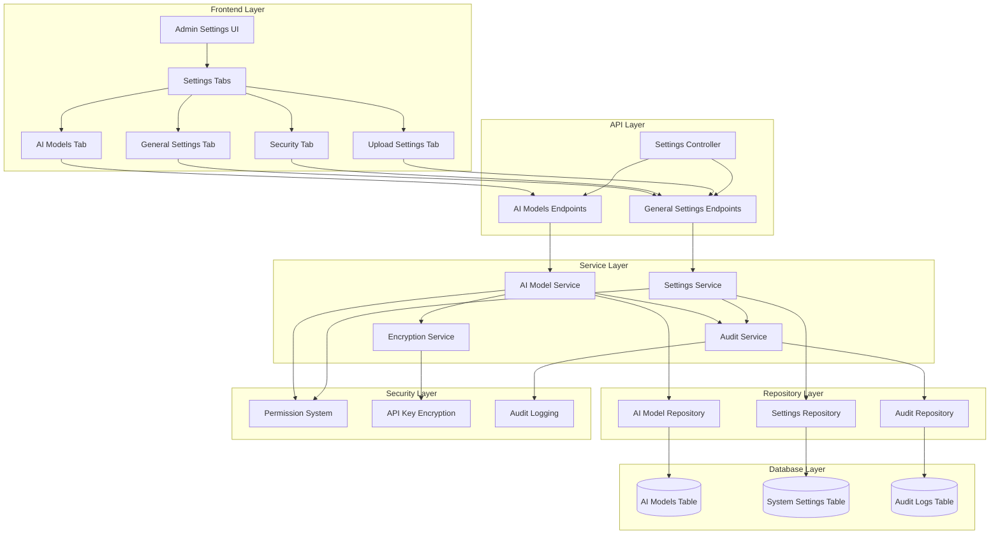
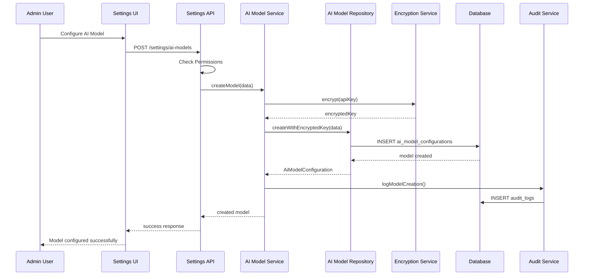
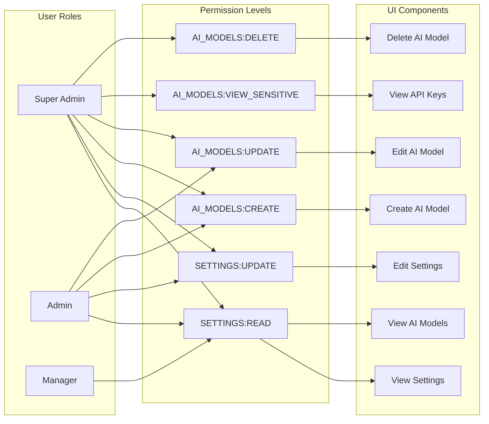
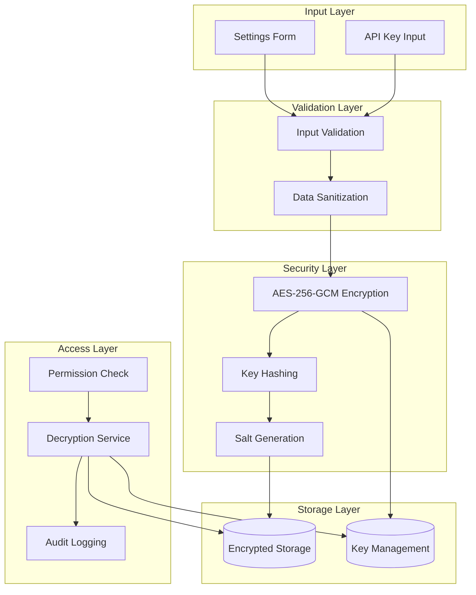
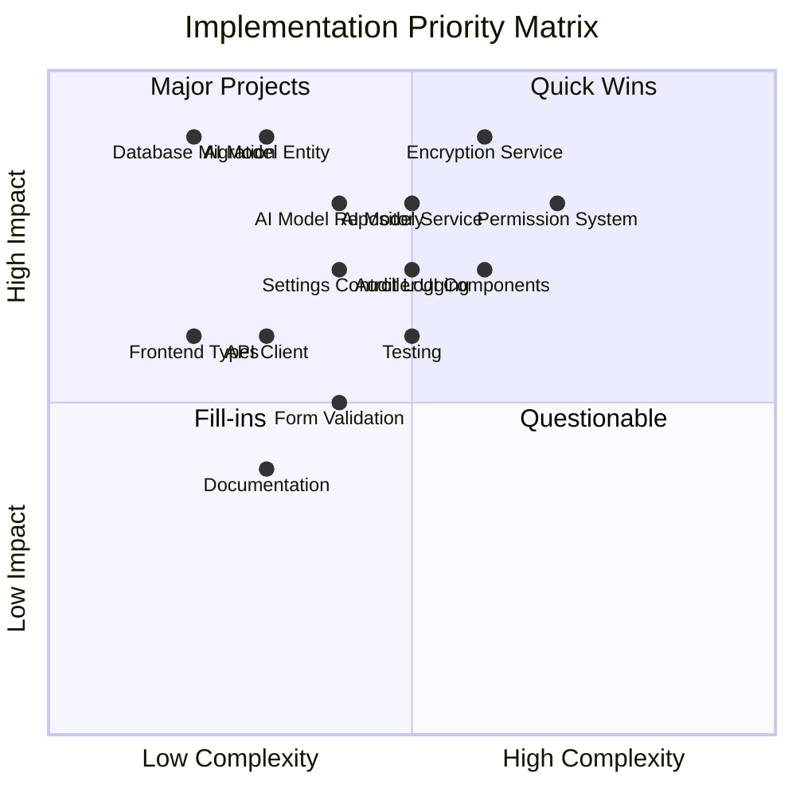

# Admin Settings System Architecture Diagram

## System Overview



## AI Model Configuration Flow



## Permission-Based Access Control



## Data Security Architecture



## Settings UI Component Hierarchy

```mermaid
graph TB
    subgraph "Main Settings Page"
        MAIN[/admin/settings/page.tsx]
    end

    subgraph "Tab Components"
        TABS[SettingsTabs.tsx]
        AI_TAB[AiModelsTab.tsx]
        GEN_TAB[GeneralSettingsTab.tsx]
        SEC_TAB[SecuritySettingsTab.tsx]
        UP_TAB[UploadSettingsTab.tsx]
    end

    subgraph "AI Models Components"
        AI_LIST[AiModelsList.tsx]
        AI_CARD[AiModelCard.tsx]
        AI_FORM[AiModelForm.tsx]
        API_INPUT[ApiKeyInput.tsx]
        TEST_CONN[TestConnection.tsx]
    end

    subgraph "General Settings Components"
        BRAND_FORM[BrandingForm.tsx]
        CONTACT_FORM[ContactForm.tsx]
        SOCIAL_FORM[SocialMediaForm.tsx]
    end

    subgraph "Security Components"
        PERM_FORM[PermissionsForm.tsx]
        AUDIT_VIEW[AuditLogViewer.tsx]
    end

    subgraph "Upload Components"
        FILE_FORM[FileSettingsForm.tsx]
        LIMIT_FORM[UploadLimitsForm.tsx]
    end

    MAIN --> TABS
    TABS --> AI_TAB
    TABS --> GEN_TAB
    TABS --> SEC_TAB
    TABS --> UP_TAB

    AI_TAB --> AI_LIST
    AI_LIST --> AI_CARD
    AI_TAB --> AI_FORM
    AI_FORM --> API_INPUT
    AI_CARD --> TEST_CONN

    GEN_TAB --> BRAND_FORM
    GEN_TAB --> CONTACT_FORM
    GEN_TAB --> SOCIAL_FORM

    SEC_TAB --> PERM_FORM
    SEC_TAB --> AUDIT_VIEW

    UP_TAB --> FILE_FORM
    UP_TAB --> LIMIT_FORM
```

## Database Schema Relationships

```mermaid
erDiagram
    SYSTEM_SETTINGS {
        int id PK
        string platform_name
        string support_email
        string app_logo
        string app_favicon
        string contact_phone
        string contact_address
        string social_facebook
        string social_twitter
        string social_linkedin
        string social_instagram
        int max_file_upload_size
        string[] allowed_file_types
        int default_ai_model_id FK
        boolean allow_signup
        boolean email_notifications
        boolean sms_notifications
        boolean admin_alerts
        boolean require_verification
        timestamp created_at
        timestamp updated_at
    }

    AI_MODEL_CONFIGURATIONS {
        int id PK
        uuid entity_id UK
        string provider
        string model_name
        string display_name
        string description
        string api_endpoint
        text api_key_encrypted
        boolean is_default
        boolean is_active
        int max_tokens
        decimal temperature
        decimal top_p
        decimal frequency_penalty
        decimal presence_penalty
        timestamp created_at
        timestamp updated_at
        timestamp deleted_at
    }

    AUDIT_LOGS {
        int id PK
        int performed_by FK
        string performer_name
        string action
        string target_type
        string target_id
        string details
        string ip_address
        json metadata
        timestamp created_at
    }

    USERS {
        int id PK
        string email
        string first_name
        string last_name
        string role
        timestamp created_at
        timestamp updated_at
    }

    SYSTEM_SETTINGS ||--o| AI_MODEL_CONFIGURATIONS : "default_ai_model_id"
    AUDIT_LOGS }o--|| USERS : "performed_by"
    AI_MODEL_CONFIGURATIONS ||--o{ AUDIT_LOGS : "target_id"
    SYSTEM_SETTINGS ||--o{ AUDIT_LOGS : "target_id"
```



## API Endpoint Structure

```mermaid
graph LR
    subgraph "Settings API Endpoints"
        BASE[/api/settings]
        
        subgraph "General Settings"
            GET_SET[GET /settings]
            UPDATE_SET[PATCH /settings]
        end
        
        subgraph "AI Models"
            GET_AI[GET /settings/ai-models]
            CREATE_AI[POST /settings/ai-models]
            UPDATE_AI[PATCH /settings/ai-models/:id]
            DELETE_AI[DELETE /settings/ai-models/:id]
            SET_DEFAULT[POST /settings/ai-models/:id/set-default]
            TEST_CONN[POST /settings/ai-models/:id/test-connection]
            GET_KEY[GET /settings/ai-models/:id/api-key]
        end
        
        subgraph "Security"
            GET_AUDIT[GET /settings/audit-logs]
            GET_PERMS[GET /settings/permissions]
        end
    end

    BASE --> GET_SET
    BASE --> UPDATE_SET
    BASE --> GET_AI
    BASE --> CREATE_AI
    BASE --> UPDATE_AI
    BASE --> DELETE_AI
    BASE --> SET_DEFAULT
    BASE --> TEST_CONN
    BASE --> GET_KEY
    BASE --> GET_AUDIT
    BASE --> GET_PERMS
```

## Implementation Priority Matrix



## Security Threat Model

```mermaid
graph TB
    subgraph "Threat Vectors"
        T1[API Key Exposure]
        T2[Unauthorized Access]
        T3[Data Tampering]
        T4[Privilege Escalation]
        T5[Audit Log Manipulation]
    end

    subgraph "Mitigation Strategies"
        M1[AES-256-GCM Encryption]
        M2[Role-Based Access Control]
        M3[Input Validation & Sanitization]
        M4[Permission Boundaries]
        M5[Immutable Audit Logs]
    end

    subgraph "Monitoring & Detection"
        MON1[Failed Access Attempts]
        MON2[Unusual API Key Access]
        MON3[Settings Change Patterns]
        MON4[Permission Escalation Attempts]
    end

    T1 --> M1
    T2 --> M2
    T3 --> M3
    T4 --> M4
    T5 --> M5

    M1 --> MON2
    M2 --> MON1
    M3 --> MON3
    M4 --> MON4
    M5 --> MON3